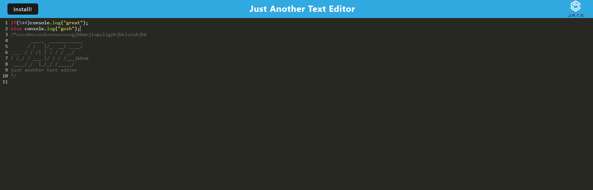

# textEditor

This program presents a text editor with js highlighting, and redundant saving capacity to local storage. 
On launch of the website, there is the option to install it to the browser, allowing the app to function without internet connection. 

  

Try it ou here: <a href="https://yetanothertexteditor.herokuapp.com/">Link</a>  

For any questions, please contact me by email: <a href="mailto:nialvo@protonmail.com">Email</a>
